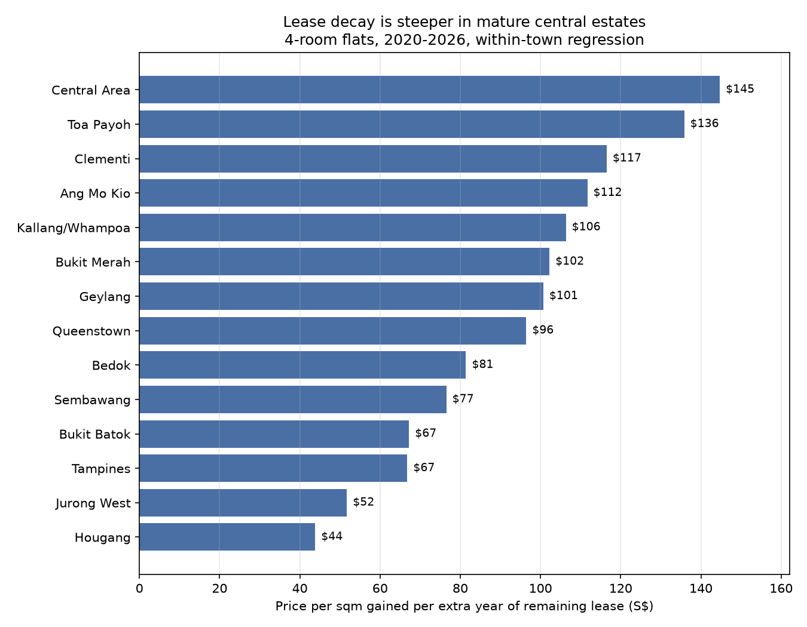

# HDB Resale Lease Decay

A data pipeline over 986,090 Singapore HDB resale transactions (1990–2026),
built to measure how much of a flat's price is explained by its remaining lease
— and whether that relationship differs across towns.

*14 of 24 towns. The rest are excluded: their lease spread is too narrow for the
regression to mean anything (Punggol's flats all have 75+ years remaining).*

## Finding

Within a single town, holding flat type and period constant, an extra year of
remaining lease is worth between **$145 and $44 per square metre** depending on
where the flat is. The ordering tracks distance from the city centre almost
exactly: mature central estates at the top, outer new towns at the bottom.

Comparing 2013–2016 against 2018–2021, **eleven of twelve measurable towns show
a steeper slope in the later period**, measured relative to price level so the
post-2020 boom doesn't explain it. This is consistent with rising lease
awareness after 2017, though the 2019 CPF rules tying usable CPF to remaining
lease are at least as plausible a cause as the 2017 statement that flats revert
to the state with no value.

## Pipeline

Five source CSVs → Postgres raw layer (all TEXT) → clean view → star schema.

- `raw_resale` — 986,090 rows, one per transaction, with provenance columns
- `clean_resale` — a view handling type conversion and normalisation
- `dim_building` (10,005), `dim_town` (27), `dim_flat_type` (8),
  `dim_flat_model` (21), `dim_storey` (25), `dim_date` (441 months)
- `fact_resale` — 986,090 rows, foreign keys to all six

Six automated data quality tests, run with `pytest`.

## What was wrong with the source data

Four inconsistencies, each found by profiling rather than assumed. None are
documented by the publisher.

**`remaining_lease` means three different things.** Absent in the 1990–1999,
2000–2012 and 2012–2014 files. A bare integer (`70`) in 2015–2016. Formatted
text (`61 years 04 months`) in 2017 onwards. Same column name, three formats,
and two thirds of rows don't have it at all.

**The date column changes definition in March 2012.** Files up to 2012-02 use
approval date; everything after uses registration date. These are different
points in the same transaction, weeks apart, and not convertible. Any
month-over-month trend crossing that boundary carries a small artificial
discontinuity. Recorded per row in `date_basis`.

**13 of 21 flat models are split across two spellings.** The 1990–1999 file uses
`MODEL A`; every later file uses `Model A`. Grouping without normalising
understates MODEL A by 70,381 rows. Verified safe to merge by confirming the two
spellings never appear in the same source file — if they had, uppercasing might
have merged two genuinely different things.

**A five-storey bucket scheme exists for three months.** `01 TO 05`, `06 TO 10`
and six others appear only between 2012-03 and 2012-05 — 6,838 rows, 0.7% of the
data. Everything else uses three-storey buckets. These rows are kept but flagged
so they drop out of storey-based analysis rather than being deleted or forcing
everything else to be coarsened.

## Engineering decisions

**The raw layer is entirely TEXT.** A single malformed value in an INTEGER column
fails the whole load and blocks you at row 400,000. Loading as text means bad
rows become data you can count and inspect rather than an obstacle. As it turned
out, zero rows fail conversion — but that was only knowable after checking.

**Remaining lease is derived, not parsed.** Rather than handle three formats
covering 28% of rows, `99 - (sale_year - lease_commence_year)` is applied to all
986,090 rows. Validated against HDB's own value on the 277,040 rows where one
exists: agreement within one year everywhere, with one exception traced to a
source error. The residual is explained — we subtract calendar years, HDB counts
from the actual commencement date, so the discrepancy depends on whether the sale
falls before or after the lease anniversary. January sales cluster at the
boundary for exactly that reason.

**`dim_building` is a Type 2 slowly changing dimension.** Three addresses out of
10,004 have more than one lease commencement year, and they turned out to be
three different problems:

- **21 Teban Gardens Rd** — a redevelopment. 17-year gap in sales, 35-year jump
  in lease year. Genuinely two buildings sharing an address, so it gets two
  dimension rows distinguished by a validity range. This is the case that
  required surrogate keys; a natural key cannot represent it.
- **37 Teban Gardens Rd** — a single-row typo. One 2025 sale records 1981; the
  other 20 sales of that block record 1966, and HDB's own `remaining_lease` on
  the bad row (40 years 01 month) implies 1966, not 1981.
- **114 Jurong East St 13** — a records correction, not a typo. The value changes
  from 1981 to 1982 in early 2015 and stays there, and HDB's `remaining_lease`
  agrees with 1982 in every post-2015 sale. Majority vote would have chosen 1981
  and been wrong.

`fact_resale` computes remaining lease from the dimension rather than the raw
row, so these corrections apply structurally instead of as special cases.

**The first version of the analysis was wrong.** Plotting price per sqm against
remaining lease across all flats produces a U-shaped curve where the shortest
leases look most expensive. That's location: old flats cluster in central mature
estates, and the location premium is larger than the lease effect. Holding flat
type constant isn't enough — the comparison has to happen within a town.

## Limitations

**Lease and building age are the same variable here.** A flat with 50 years
remaining is a 49-year-old building. Nothing in this data separates "shorter
lease" from "older building, dated layout, ageing infrastructure". This cannot
be fixed with HDB resale data alone, and it means the slopes should be read as
the combined effect, not as lease decay in isolation.

**Nothing is controlled within a town.** Distance to MRT, exact block, storey
and floor area all vary inside each town-lease cell and all affect price.

**The 2020+ window contains a price boom.** If lease-poor and lease-rich flats
appreciated at different rates during it, some of the measured slope is boom
dynamics.

**Plain averages, no dispersion or outlier handling.** R² indicates where the fit
is weak, but the distributions themselves haven't been examined.

**September 2026 is partial.** Registrations arrive through the month, so the
final month understates volume and should be excluded from trend work.

None of this is property advice.

## Data and licence

Source: [HDB Resale Flat Prices](https://data.gov.sg/collections/189/view),
data.gov.sg, accessed 6 September 2026.

- `d_ebc5ab87086db484f88045b47411ebc5` — 1990–1999
- `d_43f493c6c50d54243cc1eab0df142d6a` — 2000–Feb 2012
- Mar 2012–Dec 2014, Jan 2015–Dec 2016 — see collection page
- `d_8b84c4ee58e3cfc0ece0d773c8ca6abc` — Jan 2017 onwards

Contains information from the datasets above, accessed 6 September 2026 from
data.gov.sg, made available under the terms of the
[Singapore Open Data Licence version 1.0](https://data.gov.sg/open-data-licence).

This repository has no official status and is not affiliated with or endorsed by
HDB or any Singapore government agency.

The code in this repository is MIT licensed. That covers the code only — the
data remains under the Singapore Open Data Licence, and this repository grants no
rights over it.

A note on privacy: HDB publishes this data, and the licence grants no rights over
personal data within it. Block, street, storey range, floor area and month
together identify a specific household's sale price. That is the publisher's
choice, but it's worth stating that these are real transactions by real people.

## Running it
